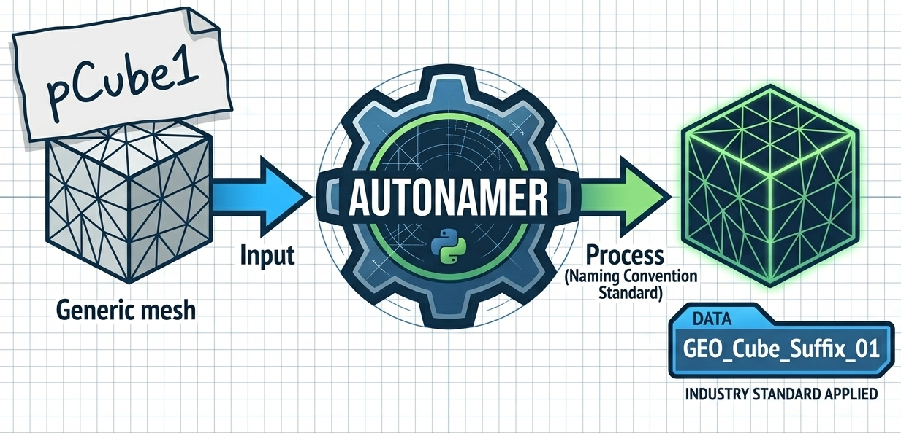
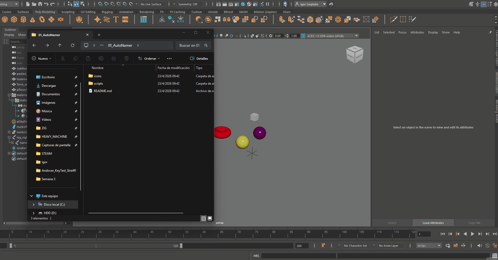

  <a href="#english-version">English</a> | <a href="#spanish-version">Español</a>

---

# TechArt AutoNamer for Maya (UE5 Standard)

A professional tool for Autodesk Maya designed to automate and standardize object naming conventions based on the **Unreal Engine 5** guidelines.

Developed as a project for the course **TechArt - Max Sarlija Academy**.

## 🚀 Purpose
Naming conventions are the backbone of any scalable pipeline. This tool ensures that assets are consistently named, cleaned of technical junk, and ready for export to Unreal Engine 5 with a single click. It eliminates manual errors and significantly speeds up the scene organization process.

## 🎥 Demo

## ✨ Features
*   **Automatic Prefixing:** Detects node types (Mesh, Joints, Curves, Cameras, Lights) and applies correct prefixes (`SM_`, `SK_`, `CTRL_`, `CAM_`, `LIT_`).
*   **Recursive Cleaning (Anti-Stacking):** Intelligent logic that strips old or duplicated prefixes and suffixes (e.g., `LIT_LIT_GRP_Cube` becomes `LIT_Cube_L`).
*   **Side & Poly Detection:** Automatically identifies "Left/Right" or "High/Low Poly" in the original name and converts them to standard suffixes (`_L`, `_R`, `_HP`, `_LP`).
*   **Material Auto-Rename:** Automatically renames materials connected to selected meshes using the `M_` prefix and the object's base name.
*   **Global Character Support:** Automatically replaces spaces with underscores and cleans special characters to ensure cross-platform compatibility.
*   **Real-time Feedback UI:** Includes a dedicated window with a results log to track successes, errors, and changes.

## 🛠 Usage
1.  **Open Maya** and open the **Script Editor**.
2.  Create a new **MEL** tab.
3.  Paste the contents of `scripts/TechArt_AutoNamer.mel` into the tab.
4.  Run the script (Execute).
5.  A window titled **"TechArt AutoNamer"** will appear.
6.  Select the objects you want to rename in the Viewport or Outliner.
7.  Click **"RENAME SELECTION"**.
8.  Check the **Results Log** for a detailed summary of the operations.

## 🎨 Shelf Icon Setup
To add the tool to your Maya Shelf for quick access:
1.  Open the **Script Editor** and paste the code from `scripts/TechArt_AutoNamer.mel`.
2.  Go to **File > Save Script to Shelf...** and name it `AutoNamer`.
3.  **Right-click** the new icon in your shelf and select **Edit**.
4.  In the **Shelves** tab, go to the **Icon Name** field and click the **folder icon**.
5.  Navigate to the `icons/` folder in this repository and select `Icon64x64_AutoNamer.png`.
6.  Click **Save All Shelves** in the Shelf editor.

## 🧠 Creation Process
The development followed a step-by-step Tech Art methodology:
1.  **Analysis:** Interpreting naming standards from UE5 documentation to map Maya nodes to their Unreal counterparts.
2.  **Core Logic:** Implementing regex-based string manipulation in MEL to extract the "base name" of any object.
3.  **Recursive Optimization:** Developing a `while` loop system to solve the common issue of "stacked prefixes".
4.  **UI/UX Design:** Creating a simple, non-intrusive interface that provides clear feedback.

## 👤 Credits
*   **Developer:** Igor G. Streiff
*   **Academy:** TechArt Studio - Max Sarlija Academy

---

# TechArt AutoNamer para Maya (Estándar UE5)

Herramienta profesional para Autodesk Maya diseñada para automatizar y estandarizar la nomenclatura de objetos siguiendo las guías de **Unreal Engine 5**.

Desarrollado como practica de el curso **TechArt - Max Sarlija Academy**.

## 🚀 Propósito
Las convenciones de nomenclatura son la base de cualquier pipeline escalable. Esta herramienta asegura que los assets estén nombrados correctamente, libres de "basura" técnica y listos para exportar a Unreal Engine 5 con un solo clic. Elimina errores manuales y acelera drásticamente la organización de escenas complejas.

## 🎥 Demo

## ✨ Funcionalidades
*   **Prefijos Automáticos:** Detecta tipos de nodo (Mesh, Joints, Curvas, Cámaras, Luces) y aplica los prefijos correctos (`SM_`, `SK_`, `CTRL_`, `CAM_`, `LIT_`).
*   **Limpieza Recursiva (Anti-Stacking):** Lógica inteligente que elimina prefijos y sufijos viejos o duplicados (ej: de `LIT_LIT_GRP_Cubo` a `LIT_Cubo_L`).
*   **Detección de Lado y Poly:** Identifica automáticamente "Left/Right" o "High/Low Poly" en el nombre original y los convierte a sufijos estándar (`_L`, `_R`, `_HP`, `_LP`).
*   **Auto-Rename de Materiales:** Renombra automáticamente los materiales conectados a los meshes seleccionados usando el prefijo `M_` y el nombre base del objeto.
*   **Soporte de Caracteres Globales:** Reemplaza espacios por guiones bajos y limpia caracteres especiales para asegurar compatibilidad entre plataformas.
*   **Interfaz con Feedback en Tiempo Real:** Ventana dedicada con un log de resultados para trackear éxitos, errores y cambios realizados.

## 🛠 Modo de Uso
1.  **Abrir Maya** y abrir el **Script Editor**.
2.  Crear una pestaña nueva de tipo **MEL**.
3.  Pegar el contenido del archivo `scripts/TechArt_AutoNamer.mel`.
4.  Ejecutar el script (Play).
5.  Aparecerá la ventana **"TechArt AutoNamer"**.
6.  Seleccionar los objetos que quieras nomenclar en el Viewport o Outliner.
7.  Click en **"RENAME SELECTION"**.
8.  Revisar el **Results Log** para ver el resumen detallado de la operación.

## 🎨 Configuración del Icono en el Shelf
Para añadir la herramienta a tu Shelf de Maya para acceso rápido:
1.  Abre el **Script Editor** y pega el código de `scripts/TechArt_AutoNamer.mel`.
2.  Ve a **File > Save Script to Shelf...** y ponle el nombre `AutoNamer`.
3.  Haz **click derecho** sobre el nuevo icono en tu shelf y selecciona **Edit**.
4.  En la pestaña **Shelves**, busca el campo **Icon Name** y haz clic en el **icono de la carpeta**.
5.  Navega hasta la carpeta `icons/` de este repositorio y selecciona `Icon64x64_AutoNamer.png`.
6.  Haz clic en **Save All Shelves** en el editor de Shelves.

## 🧠 Proceso de Creación
El desarrollo siguió una metodología de Tech Art paso a paso:
1.  **Análisis:** Interpretación de los estándares de Unreal para mapear nodos de Maya a sus contrapartes de motor.
2.  **Lógica Core:** Implementación de manipulación de strings mediante Regex en MEL para extraer el "nombre base" real de cualquier objeto.
3.  **Optimización Recursiva:** Desarrollo de un sistema de bucles `while` para solucionar el problema común de "prefijos apilados".
4.  **Diseño de UI/UX:** Creación de una interfaz simple que proporciona feedback claro.

## 👤 Créditos
*   **Desarrollador:** Igor G. Streiff
*   **Academia:** TechArt Studio - Max Sarlija Academy

---
*Desarrollado como parte del ejercicio de la Semana 03 - Formación Tech Art.*