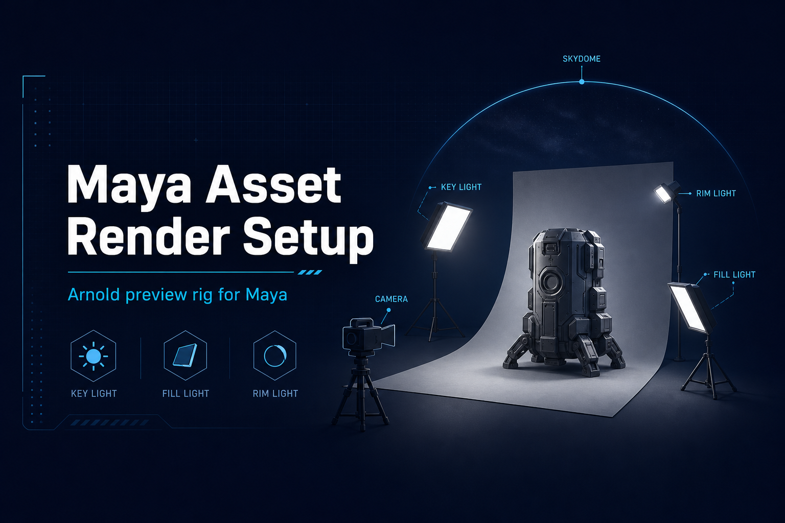

<p align="center">
  <a href="#english">English</a> | <a href="#español">Español</a>
</p>

---

<a id="english"></a>
# Maya Asset Render Setup


Python tool for Maya: **Arnold preview rig** (single or tri-cam, three-point lighting with presets, skydome, infinity cyclorama, optional reference kit) with a **toggle UI** and **Fast Render** (beauty PNG or 3-view contact sheet). Scales to your asset bounding box without moving geometry.

---

## Media

<p align="center">
  
</p>

### Demo

https://github.com/Igor-Streiff/Tech_Art_Igor_Streiff/raw/main/Maya_AssetRenderSetup/assets/demo_AssetRenderSetup.mp4

[Download demo MP4](assets/demo_AssetRenderSetup.mp4)

The shelf installer uses `assets/shelf_icon.png` automatically (re-run `install/install.py` after updating assets or moving the repo).

<br><br>

---

## Features

- **UI with toggles** — Include or skip camera, cyclorama, key/fill/rim, optional uplight, skydome, Arnold render settings.
- **Tri-Cam mode** — Optional three cameras (main 3/4, side, high) with automatic `viewFit` framing, ready for contact sheets.
- **Reference kit** — Optional chrome mirror sphere + 18% gray sphere for lighting and color validation.
- **Lighting presets** — Switch between *Default*, *Product*, *Hero*, and *Soft Fill* exposure profiles from the UI.
- **Create Setup** — Builds `TA_AssetRender_RIG` from selection or all visible meshes.
- **Fast Render** — `{scene}_beauty.png` per camera; optional tri-cam contact sheet (`*_main_beauty`, `*_side_beauty`, `*_high_beauty`). Respects scene AOVs or **Beauty only** mode.
- **Non-destructive** — Frames the asset; does not translate your geometry.
- **Idempotent** — Re-run replaces the rig (no duplicates).
- **MtoA tolerant** — Tries alternate Arnold attribute names across MtoA versions.
- **Portable install** — No hardcoded paths; clone anywhere and run the installer from Maya.

## Requirements

- Autodesk Maya **2024+** (workflow tested toward Maya 2027 + MtoA 5.6)
- **Arnold for Maya (MtoA)** installed and licensed

## Installation

Clone or unzip this repository anywhere. Then, **once**:

1. In Maya: **File → Open Script…** → open `install/install.py` → **Execute** (Ctrl+Enter).
2. If Maya asks to locate the file, select the same `install.py` you just opened.
3. Click **Asset Render** on the **Custom** shelf. Done.

If you move the repo later, re-run step 1.

<details>
<summary>Alternative install methods</summary>

- **Copy to Maya scripts:** put the whole `Maya_AssetRenderSetup/` folder inside `Documents/maya/<version>/scripts/`. Then run `install/install.py` once to add the shelf button.
- **Environment variable:** set `MAYA_ASSET_RENDER_SETUP` to the tool root folder. The shelf button auto-discovers it.
- **No shelf / one-off:** **File → Open Script…** → `scripts/open_ui.py` → **Execute** (skips shelf install entirely).
</details>

### Uninstall (before re-recording install, or to reset)

**File → Open Script…** → `install/uninstall.py` → **Execute** (auto-runs; if prompted, select `uninstall.py` in the `install/` folder)

Removes the **Asset Render** shelf button, writes shelves to disk (so the button does not reappear when switching tabs), and clears saved `optionVar` paths. It does **not** delete the repository on disk or nodes in your scene.

If you previously copied the tool to `Documents/maya/<version>/scripts/Maya_AssetRenderSetup/`, delete that folder manually when uninstall reports it.

## Usage

1. Open a scene with your Arnold-shaded asset.
2. Open the UI (shelf or `open_ui.py`).
3. **(Optional)** Select asset root transform(s) if the scene has extra geometry you want to exclude.
4. Adjust toggles → **Create Setup**.
5. View through **`TA_assetRender_cam`** → **IPR** to preview lighting.
6. Choose **output folder** → **Browse** → **Fast Render** for a PNG beauty pass.

**Fast Render requires Create Setup first** (camera `TA_assetRender_cam` must exist). It will not auto-build the rig.

### Fast Render output modes

| UI toggle | Behavior |
|-----------|----------|
| **Beauty only** OFF (default) | One `arnoldRender` per camera; respects scene AOVs. Log lists extras as `+ AOV: …` |
| **Beauty only** ON | Temporarily disables AOV disk output; `{scene}_beauty.png` only |

If you see two files per camera (e.g. `*_main.png` and `*_main_albedo.png`), that usually comes from **Render Settings → AOVs** and/or **Common → Alpha channel (Mask)** — not from the tool rendering twice. Numbered sidecars (`_1`, `_2`) are renamed to readable suffixes when possible (`_albedo`, `_mask`, etc.).

**Default file names:** `{scene}_beauty.png` (always explicit). With AOVs: `{scene}_albedo.png`, `{scene}_diffuse_direct.png`, etc. Tri-cam: `{scene}_main_beauty.png`, `{scene}_main_albedo.png`, …

Arnold may write the first AOV to the bare prefix (`{scene}.png`) during render; the tool renames outputs after render so the **lit beauty** becomes `_beauty` and flat passes get their AOV name.

### UI toggles

| Toggle | Creates |
|--------|---------|
| Camera | `TA_assetRender_cam` |
| Cyclorama | Infinity cove (loft floor + curved backdrop mesh) |
| Key / Fill / Rim | `aiAreaLight` trio, aimed at bbox center |
| Uplight | Optional low frontal fill (`TA_assetRender_uplight`, default OFF) |
| Skydome | `aiSkyDomeLight` ambient fill |
| Arnold settings | Renderer Arnold, 1920×1080, default sample preset |
| Tri-Cam | 3 cameras: main (3/4), side, high — with `viewFit` (default OFF) |
| Reference kit | Chrome mirror sphere + 18% gray sphere (default OFF) |
| Beauty only | Skip scene AOVs for Fast Render; output beauty PNG only (default OFF) |

### Lighting presets

| Preset | Key | Fill | Rim | Sky | Best for |
|--------|-----|------|-----|-----|----------|
| Default | 4.0 | 4.0 | 9.0 | 0.5 | General purpose |
| Product | 5.0 | 5.5 | 6.0 | 1.0 | Hard-surface / props (even, bright) |
| Hero | 5.5 | 2.5 | 10.0 | 0.3 | Characters (dramatic, strong rim) |
| Soft Fill | 4.5 | 5.0 | 5.0 | 1.2 | Portfolio / beauty (warm, gentle) |

### Scene nodes

| Node | Type |
|------|------|
| `TA_AssetRender_RIG` | Group |
| `TA_assetRender_cam` | Camera (main / hero) |
| `TA_assetRender_cam_side` | Camera — side view (tri-cam only) |
| `TA_assetRender_cam_high` | Camera — high view (tri-cam only) |
| `TA_assetRender_key` / `fill` / `rim` | Area lights |
| `TA_assetRender_uplight` | Area light (optional) |
| `TA_assetRender_skydome` | Skydome |
| `TA_assetRender_cyc` | Cyclorama mesh |
| `TA_assetRender_refChrome` | Chrome sphere (reference kit only) |
| `TA_assetRender_refGray` | Gray sphere (reference kit only) |

### Arnold sampling preset

Default values live in `scripts/asset_render_setup/config.py` and can be tuned per project.

| Setting | Default |
|---------|---------|
| Resolution | 1920 × 1080 |
| Camera (AA) | 7 |
| Diffuse | 3 |
| Specular | 2 |
| Transmission | 6 |
| SSS | 4 |
| Area light samples | 3 |

For noisy renders, raise only the sample type that matches the noisy AOV in Arnold Render Settings.

## Project structure

```
Maya_AssetRenderSetup/
├── README.md
├── CHANGELOG.md
├── LICENSE
├── .gitignore
├── assets/                 # banner, shelf icon, demo MP4 (embed via GitHub URL in README)
├── scripts/
│   ├── open_ui.py          # launch UI without shelf
│   ├── TA_assetRenderSetup.mel   # optional MEL entry (legacy)
│   └── asset_render_setup/ # Python package
└── install/
    ├── install.py          # one-step shelf installer (auto-runs)
    └── uninstall.py        # remove shelf button + optionVars
```

## Python API

After install (or with `MAYA_SCRIPT_PATH` / user scripts copy):

```python
from asset_render_setup import RigOptions, create_setup, fast_render, show

show()

opts = RigOptions(
    tri_cam=True,
    reference_kit=True,
    lighting_preset="hero",
    beauty_only=True,   # beauty PNG only; ignore scene AOVs
)
create_setup(opts)
fast_render("C:/renders/output", options=opts)
# → AssetName_main_beauty.png, AssetName_side_beauty.png, AssetName_high_beauty.png
```

## Troubleshooting

| Issue | What to try |
|-------|-------------|
| Black silhouette in IPR | Re-run **Create Setup** with all lights on; confirm MtoA is loaded. |
| `arnoldRender` fails | Fast Render falls back to `cmds.render`; check the UI log. |
| Wrong framing | Select only the asset root, then **Create Setup**. |
| Shelf does nothing | Re-run `install/install.py`; check Script Editor for errors. |
| Tool not found after move | Re-run installer or set `MAYA_ASSET_RENDER_SETUP`. |
| Fast Render says setup missing | Run **Create Setup** with Camera enabled first. |
| Extra `_albedo.png` etc. | Scene AOVs in Arnold → Render Settings → AOVs; or enable **Beauty only**. |

## Customization

- **Lighting / cyclorama scale:** `scripts/asset_render_setup/config.py`
- **Lighting presets:** add entries to `LIGHTING_PRESETS` in `config.py`
- **Shelf icon:** add `assets/shelf_icon.png` and point `install/install.py` `image=` to your file
- **Version string:** `scripts/asset_render_setup/config.py` (`__version__`)

## Alternatives & landscape

| Tool | Type | Strengths | Gaps vs this tool |
|------|------|-----------|-------------------|
| [Lookdev Kit](https://www.dusankovic.com/pages/lookdev-kit) (Dusan Kovic) | Free Python | HDR library, batch `kick`, turntable, DoF | No modular install, no contact sheet PNG |
| [LightIt](https://flippednormals.com/product/script-lightit-for-maya-and-arnold-38965) | Commercial ($60) | Preset studio scenes, HDRI manager | Closed source, no bbox scaling |
| [Turntabler 1.0](https://modelinghappy.com/archives/51382) | Gumroad ($5) | 360 turntable, multi-cam, Macbeth | No Python API, no Fast Render |
| Template scenes (.ma) | Free / paid | Ready-to-use, high art quality | No procedural scaling, manual framing |
| **Maya Asset Render Setup** | Free / MIT | Modular, portable install, Fast Render, contact sheet, presets, API | No HDR library, no turntable animation |

## Roadmap

| Version | Scope | Status |
|---------|-------|--------|
| **v2.0** | Single cam, 3-point + cove + skydome, Fast Render, toggle UI | Released |
| **v3.0** | Tri-cam, reference kit, lighting presets, contact sheet | Released |
| **v3.0.1** | Fast Render polish, naming, install fixes, Beauty only toggle | Current |
| v3.1 | Simple turntable (rotate asset or camera, playblast / render sequence) | Planned |
| v4+ | Multi-DCC (Blender), HDR batch, Nuke AOV export | Out of scope (see alternatives above) |

## Author & license

- **Author:** Igor G. Streiff
- **License:** MIT — see [LICENSE](LICENSE)

---

<a id="español"></a>
# Maya Asset Render Setup


Herramienta Python para Maya: rig de preview **Arnold** (cámara simple o tri-cam, iluminación three-point con presets, skydome, ciclorama infinity cove, kit de referencia opcional), **UI con toggles** y **Fast Render** (PNG beauty o contact sheet de 3 vistas). Escala al bounding box del asset sin mover la geometría.

---

## Medios

<p align="center">
  
</p>

### Demostración

https://github.com/Igor-Streiff/Tech_Art_Igor_Streiff/raw/main/Maya_AssetRenderSetup/assets/demo_AssetRenderSetup.mp4

[Descargar demo MP4](assets/demo_AssetRenderSetup.mp4)

El instalador del shelf usa `assets/shelf_icon.png` automáticamente (vuelve a ejecutar `install/install.py` si mueves el repo).

<br><br>

---

## Características

- **UI con toggles** — Cámara, ciclorama, key/fill/rim, uplight opcional, skydome, ajustes Arnold.
- **Tri-Cam** — Opcional: tres cámaras (main 3/4, side, high) con `viewFit` automático, listas para contact sheet.
- **Kit de referencia** — Opcional: esfera cromo espejo + esfera gris 18% para validar iluminación y color.
- **Presets de iluminación** — *Default*, *Product*, *Hero*, *Soft Fill* desde la UI.
- **Create Setup** — Crea `TA_AssetRender_RIG` desde la selección o todos los meshes visibles.
- **Fast Render** — `{scene}_beauty.png` por cámara; contact sheet tri-cam opcional. Modo **Beauty only** o respeta AOVs de la escena.
- **No destructivo** — Encuadra el asset; no traslada tu geometría.
- **Idempotente** — Volver a ejecutar reemplaza el rig (sin duplicados).
- **Instalación portable** — Sin rutas fijas.

## Requisitos

- Autodesk Maya **2024+**
- **Arnold for Maya (MtoA)** instalado y con licencia

## Instalación

Clona o descomprimí el repo donde quieras. Después, **una sola vez**:

1. En Maya: **Archivo → Abrir script…** → abrí `install/install.py` → **Ejecutar** (Ctrl+Enter).
2. Si Maya pide ubicar el archivo, seleccioná el mismo `install.py` que acabás de abrir.
3. Clic en **Asset Render** en el shelf **Custom**. Listo.

Si movés el repo a otro disco, repetí el paso 1.

Sin shelf / uso directo: **Abrir script…** → `scripts/open_ui.py` → Ejecutar.

### Desinstalar

**Archivo → Abrir script…** → `install/uninstall.py` → **Ejecutar** (auto-ejecuta; si pide archivo, seleccioná `uninstall.py` en `install/`)

Quita el botón del shelf, guarda los shelves en disco y borra las `optionVar` de rutas. No borra el repositorio ni el rig en la escena.

## Uso

1. Abre la escena del asset con materiales Arnold.
2. Abre la UI → ajusta toggles → **Create Setup**.
3. Vista desde **`TA_assetRender_cam`** → **IPR**.
4. Carpeta de salida → **Browse** → **Fast Render**.

**Fast Render exige Create Setup antes** (debe existir la cámara `TA_assetRender_cam`). No crea el rig automáticamente.

**Modos de salida:** `{scene}_beauty.png` + `{scene}_{aov}.png` si hay AOVs activos (p. ej. `_albedo`). **Beauty only** ON → solo beauty. Ver sección equivalente en [English](#english).

**AOVs en Maya:** Arnold → Render Settings → pestaña **AOVs** — ahí se activan/desactivan passes extra (no es opción de esta tool).

## Personalización

- Valores de luces, ciclorama y samples: `scripts/asset_render_setup/config.py`
- Presets de iluminación: añade entradas a `LIGHTING_PRESETS` en `config.py`

## Alternativas y contexto

| Herramienta | Fortalezas | Diferencia con este tool |
|-------------|-----------|--------------------------|
| [Lookdev Kit](https://www.dusankovic.com/pages/lookdev-kit) | Biblioteca HDR, turntable, batch `kick` | Sin install modular, sin contact sheet PNG |
| [LightIt](https://flippednormals.com/product/script-lightit-for-maya-and-arnold-38965) ($60) | Escenas preset, HDRI manager | Código cerrado, sin escalado por bbox |
| [Turntabler 1.0](https://modelinghappy.com/archives/51382) ($5) | Turntable 360, multi-cam, Macbeth | Sin API Python, sin Fast Render |
| Plantillas .ma | Calidad artística lista | Sin escalado procedimental, encuadre manual |
| **Maya Asset Render Setup** | Modular, install portable, Fast Render, contact sheet, presets, API | Sin biblioteca HDR, sin turntable animado |

## Roadmap

| Versión | Alcance | Estado |
|---------|---------|--------|
| **v2.0** | Cámara única, 3-point + cove + skydome, Fast Render, UI con toggles | Publicada |
| **v3.0** | Tri-cam, kit de referencia, presets, contact sheet | Publicada |
| **v3.0.1** | Pulido Fast Render, nombres, install, toggle Beauty only | Actual |
| v3.1 | Turntable simple (rotación de asset o cámara, playblast / render sequence) | Planificado |
| v4+ | Multi-DCC (Blender), batch HDR, export AOV Nuke | Fuera de scope (ver alternativas) |

## Autor y licencia

- **Autor:** Igor G. Streiff
- **Licencia:** MIT — ver [LICENSE](LICENSE)
