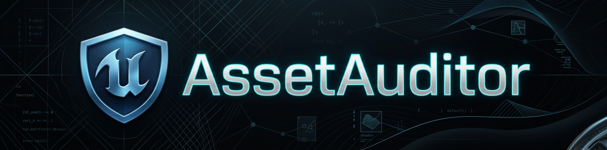

# UE Asset Auditor Tool

*[Español abajo](#español)*

Automated technical audit tool for **Unreal Engine 5.6+**, designed for quality control, memory optimization, and asset management in large-scale projects.

  

## 🎥 Demo
https://github.com/user-attachments/assets/c9fad7df-e1e5-41ee-956e-0126d166bbda

## 🚀 Features

### Asset Auditing
- **Mesh Topology Audit**: Vertex count, triangle count, LODs, Nanite status, material slot count, and heuristic ngon detection.
- **Texture Memory Control**: Detects textures exceeding optimal resolution thresholds (default >2048px).
- **Material Analysis**: Identifies translucent materials that carry a high GPU cost.
- **Orphan Detection**: Finds assets with zero references that waste disk space.
- **Sequencer Inventory**: Lists all `LevelSequence` assets in the project.

### Level Actor Auditing
- **Light Audit**: Counts and catalogs all light actors in the current level.
- **PostProcess Audit**: Detects `PostProcessVolume` actors and flags volumetric features.
- **Fog Audit**: Detects `ExponentialHeightFog` actors and warns if Volumetric Fog is enabled.

### Warnings & Diagnostics
| Tag | Trigger | Priority |
|-----|---------|----------|
| `MESH_LOD` | No Nanite + fewer than 3 LODs | High |
| `MESH_HEAVY` | More than 100,000 triangles | High |
| `MESH_SLOTS` | More than 5 material slots | Medium |
| `MESH_NGON` | Suspicious tri/vert ratio (possible ngons in source) | Low |
| `MESH_COLLISION` | Uses Complex Collision as Simple (high CPU cost) | High |
| `TEX_LARGE` | Resolution exceeds threshold | Medium |
| `MAT_TRANSLUCENT` | Material uses translucent blend mode | Medium |
| `FOG_VOLUMETRIC` | Volumetric Fog is enabled (high GPU cost) | Medium |
| `AUDIO_INLINE` | Audio forced to load into RAM instead of streaming | Medium |
| `ORPHAN` | Asset has zero references | Low |

### Output
- **JSON Report**: Versioned (`Audit_ProjectName_v00.json`) with full metadata.
- **HTML Dashboard**: Interactive report with search, filters, sortable columns, and detail panel with asset cross-referencing.
- **Dynamic Versioning**: Incremental version per project (`v00`, `v01`, `v02`...).

## 🛠️ Requirements
1. **Unreal Engine 5.6.1** or later.
2. **Python Editor Script Plugin** enabled (`Edit > Plugins`). Enabled by default in UE 5.6+.

## 📖 Usage
### Available Scripts
| Script | Output |
|--------|--------|
| `asset_auditor.py` | JSON report + HTML Dashboard |

### How to Run (In-Editor)
1. Open your project in Unreal Engine.
2. Go to **Tools > Execute Python Script...**
3. Navigate to `Scripts/` and select the desired script.
4. Reports are saved to the `Reports/` folder.

## 👨‍💻 Author
By **Igor G. Streiff**

## ⚖️ License
This project is under the MIT License.

---
---

# UE Asset Auditor Tool (Español)

*[English above](#english)*

Herramienta de auditoría técnica automatizada para **Unreal Engine 5.6+**, diseñada para control de calidad, optimización de memoria y gestión de assets en proyectos a gran escala.

  

## 🎥 Demostración
https://github.com/user-attachments/assets/c9fad7df-e1e5-41ee-956e-0126d166bbda

## 🚀 Características

### Auditoría de Assets
- **Topología de Mallas**: Conteo de vértices, triángulos, LODs, estado de Nanite, ranuras de material y detección heurística de ngons.
- **Control de Texturas**: Detecta texturas que exceden la resolución óptima (por defecto >2048px).
- **Análisis de Materiales**: Identifica materiales translúcidos con alto costo de GPU.
- **Detección de Huérfanos**: Encuentra assets con cero referencias que ocupan espacio en disco.
- **Inventario de Secuencias**: Lista todos los assets `LevelSequence` en el proyecto.

### Auditoría de Actores de Nivel
- **Auditoría de Luces**: Cuenta y cataloga todas las luces en el nivel actual.
- **Post-Procesado**: Detecta actores `PostProcessVolume` e identifica características volumétricas.
- **Niebla**: Detecta actores `ExponentialHeightFog` y advierte si la Niebla Volumétrica está activada.

### Advertencias y Diagnósticos
| Tag | Condición | Prioridad |
|-----|-----------|-----------|
| `MESH_LOD` | Sin Nanite + menos de 3 LODs | Alta |
| `MESH_HEAVY` | Más de 100,000 triángulos | Alta |
| `MESH_SLOTS` | Más de 5 ranuras de material | Media |
| `MESH_NGON` | Proporción tris/verts sospechosa (posibles ngons en origen) | Baja |
| `MESH_COLLISION` | Usa Colisión Compleja como Simple (alto costo de CPU) | Alta |
| `TEX_LARGE` | La resolución excede el umbral | Media |
| `MAT_TRANSLUCENT` | Material usa modo de mezcla translúcido | Media |
| `FOG_VOLUMETRIC` | Niebla volumétrica activada (alto costo GPU) | Media |
| `AUDIO_INLINE` | Audio forzado a cargar en RAM en lugar de Streaming | Media |
| `ORPHAN` | Asset no tiene referencias | Baja |

### Salida
- **Reporte JSON**: Versionado (`Audit_ProjectName_v00.json`) con metadatos completos.
- **Dashboard HTML**: Reporte interactivo con buscador, filtros, columnas ordenables y panel de detalles.
- **Versionado Dinámico**: Incremento automático por proyecto (`v00`, `v01`, `v02`...).

## 🛠️ Requisitos
1. **Unreal Engine 5.6.1** o superior.
2. **Python Editor Script Plugin** activado (`Edit > Plugins`). Activado por defecto en UE 5.6+.

## 📖 Uso
### Scripts Disponibles
| Script | Salida |
|--------|--------|
| `asset_auditor.py` | Reporte JSON + Dashboard HTML |

### Cómo ejecutar (En el Editor)
1. Abre tu proyecto en Unreal Engine.
2. Ve a **Tools > Execute Python Script...**
3. Navigate to `Scripts/` y selecciona el script deseado.
4. Los reportes se guardan en la carpeta `Reports/`.

## 👨‍💻 Autor
Por **Igor G. Streiff**

## ⚖️ Licencia
Este proyecto está bajo la Licencia MIT.
